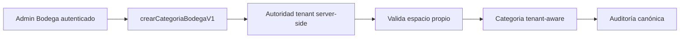

# ADR-SAAS-052 — Creación tenant-aware de categorías Bodega

## Estado

**ACEPTADO.**

**Fecha de propuesta y aceptación formal:** 2026-10-01.

Esta aceptación constituye una decisión de gobernanza para
`G-SAAS-02 → M2 — Provisioning y onboarding → E2.2 — Configuración inicial`.
Autoriza únicamente implementar y probar la frontera de categoría Bodega, su
adaptador administrativo mínimo y el enforcement Firestore estrictamente
necesario para evitar doble autoridad. No autoriza despliegues, creación de
categorías, fixture adicional, Bootstrap, Activation, tráfico, IAM, Secrets,
producción ni cambios a otros boundaries.

## Contexto y evidencia

El fixture sintético retenido `E2_2-BODEGA-STAGING-FIXTURE` fue creado en
`micafe-pos-staging` mediante el Bootstrap canónico y su incorporación ya está
`ACTIVE`. Bootstrap crea el espacio inicial
`esp_E2_2-BODEGA-STAGING-FIXTURE_1` (`Espacio Principal`), pero no materializa
ningún documento en `categorias`.

La interfaz Bodega exige una `categoriaId` para crear un producto base. El
formulario queda deshabilitado cuando no existen categorías, y
`crearArticuloInventarioV1` conserva la misma precondición en servidor:
`CATEGORIA_INVALIDA` cuando falta el valor. Por tanto no es posible preparar
productos, presentaciones, stock y venta del fixture mediante el flujo
canónico actual.

No existe una pantalla, callable o servicio tenant-aware para crear una
categoría. El único escritor localizado, `scripts/seed-espacios.ts`, es un
seed directo de Firestore con datos de MiCafe; no es tenant-scoped, no está
auditado para staging y no puede usarse para el fixture ni como mecanismo de
producción.

Las Rules vigentes permiten a un administrador autenticado crear, actualizar y
eliminar documentos `categorias` por escritura cliente. Esa ruta conserva el
aislamiento por `empresaId`, pero no valida el espacio Bodega, no tiene
idempotencia de comando ni produce auditoría canónica. Por ello no satisface
la frontera necesaria para el catálogo Bodega y no debe coexistir como ruta de
escritura Bodega después de la implementación.

ADR-SAAS-049 limita deliberadamente `saas-bodega` a cinco callables. ADR-SAAS-
048 exige que el fixture se cree y opere mediante mecanismos seguros y
auditables. La ausencia de categoría es, por tanto, una dependencia de
producto y arquitectura no cubierta por las ADR aceptadas.

## Problema a decidir

Se requiere una superficie canónica para que un administrador tenant Bodega
cree una categoría asociada a un espacio de su propia empresa, con autoridad
derivada de servidor y auditoría. La decisión debe permitir configurar el
catálogo del fixture y de futuros tenants sin recurrir a escrituras directas,
scripts de seed ni un endpoint privilegiado específico de staging.

## Alternativas evaluadas

| Alternativa | Resultado | Motivo |
| --- | --- | --- |
| Ejecutar `scripts/seed-espacios.ts` | Rechazada | Es una escritura directa, no tenant-aware y contiene datos de MiCafe. |
| Reejecutar o extender Bootstrap para el fixture existente | Rechazada | El Bootstrap no puede repetirse y alterar su contrato no corrige el tenant ya creado. |
| Endpoint de plataforma exclusivo para staging | Rechazada | Añade privilegio administrativo y un flujo especial que no resuelve el producto reusable. |
| Agregar una creación tenant-aware de categoría al boundary Bodega | **Propuesta** | Mantiene la administración de catálogo en el tenant, autoridad server-side y un flujo reusable. |

## Decisión propuesta

Extender `saas-bodega` con una única callable Gen2 adicional:

`crearCategoriaBodegaV1`

La callable conservará `us-central1`, Node.js 22 y cero Secrets. No aceptará
`empresaId`, `uid`, rol, permisos ni identificadores de otro tenant como
autoridad de cliente. Derivará tenant, membresía, rol y permisos desde Auth y
servidor; exigirá rol `admin`, configuración `vertical: BODEGA_MVP1` y módulo
`inventory` habilitado; validará que `espacioId` existe, pertenece al mismo
tenant y está operativo; validará el nombre y los campos permitidos; y creará
la categoría con `empresaId`, `espacioId`, estado activo, orden determinista e
auditoría canónica.

La administración Bodega incorporará una UI mínima para crear la categoría.
No se sembrará una categoría implícita ni se crearán datos durante el deploy.

La implementación ajustará las Rules de `categorias` para denegar escrituras
cliente cuando la configuración del tenant sea `BODEGA_MVP1`; la callable,
mediante Admin SDK, será la única ruta de mutación de categoría para ese
vertical. El comportamiento legacy de categorías de verticales distintos queda
fuera de esta decisión y debe conservarse expresamente en las pruebas Rules.

## Contrato aceptado

La request es un command envelope Bodega con `commandId`, `idempotencyKey`,
`correlationId` y `payload` cerrado: `espacioId`, `nombre` e `icono` opcional.
No admite campos de autoridad ni un `orden` controlado por cliente. La respuesta
incluye `categoriaId`, `idempotente` y el `commandId` efectivo.

- ausencia de Auth o membresía inválida conserva la semántica vigente de
  `exigirTenantActivo()`;
- actor que no es `admin`, vertical/capability no autorizadas, espacio ajeno o
  no operativo devuelve `permission-denied` sin escribir;
- request o campos desconocidos/inválidos devuelve `invalid-argument`;
- mismo `idempotencyKey` y fingerprint devuelve el resultado original sin
  duplicar categoría; reutilización incompatible se rechaza;
- todo alta confirmada genera auditoría atribuible al actor efectivo;
- el tenant siempre se deriva en servidor, por lo que un `empresaId` enviado
  por cliente no puede seleccionar otra empresa.

La implementación debe probar explícitamente que las Rules deniegan escritura
cliente Bodega directa y que continúan preservando el comportamiento legacy
permitido para verticales no Bodega. No se modifica por esta decisión el
contrato de Bootstrap ni las cinco callables existentes de ADR-SAAS-049.

## Consecuencias si se acepta

1. ADR-SAAS-049 deberá complementarse, no reescribirse, para registrar la
   sexta superficie Bodega y su aislamiento.
2. La implementación requerirá un PR independiente con pruebas de autoridad,
   aislamiento, idempotencia, auditoría, discovery de seis endpoints,
   module-load y cero Secrets.
3. El deploy requerirá un nuevo preflight y un gate staging dirigido; no se
   infiere de los deploys actuales.
4. Solo después de validarlo se podrá crear una categoría sintética del
   fixture retenido y reanudar Gate E.

## Fuera de alcance

- crear o modificar categorías en este gate documental;
- datos reales, Distribuidora Las Jiménez y producción;
- cleanup destructivo del fixture;
- cambios a Bootstrap, `saas-auth`, `saas-platform-tenant-access`, Rules, IAM
  o Secrets;
- migrar o retirar callables legacy.

## Relación con ADRs existentes

- **ADR-SAAS-041 y ADR-SAAS-042:** conserva los contratos y efectos Bodega;
  no los modifica silenciosamente.
- **ADR-SAAS-048:** permite completar el fixture retenido solo después de los
  gates aprobados; conserva su política de retención.
- **ADR-SAAS-049:** amplía únicamente mediante decisión explícita una frontera
  que hoy declara exactamente cinco callables.
- **ADR-SAAS-050 y ADR-SAAS-051:** permanecen intactas; no se usan sus
  privilegios de plataforma ni su Secret para catálogo Bodega.

## Gates posteriores

1. aceptación formal y sincronización documental;
2. implementación aislada y pruebas;
3. PR, CI, auditoría y merge;
4. preflight de deploy dirigido;
5. deploy staging autorizado;
6. validación de `crearCategoriaBodegaV1` con el fixture retenido;
7. reanudación de Gate E de E2.2.

Hasta que la implementación, el PR, CI, preflight y deploy dirigido estén
cerrados, E2.2 permanece `EN EJECUCIÓN` y Gate E permanece bloqueado por la
ausencia de un mecanismo canónico de categoría desplegado y validado.
