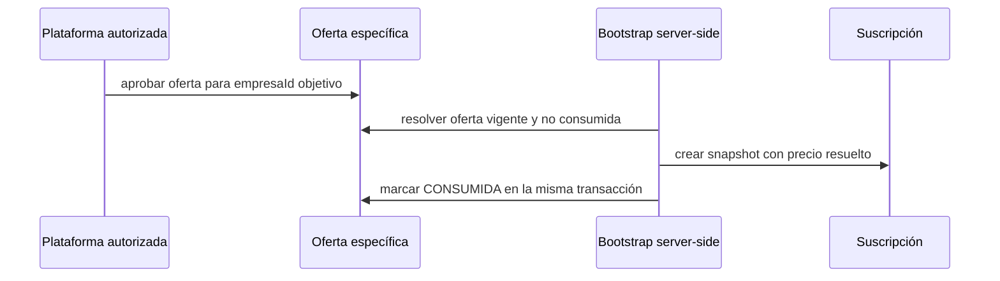

# ADR-SAAS-061 — Oferta comercial específica por tenant

## Estado

**ACEPTADO — 2026-10-05.**

Pertenece a `G-SAAS-02 → M2 — Provisioning y onboarding → E2.2 —
Configuración inicial`.

La aceptación autoriza únicamente la implementación controlada de esta frontera
de oferta comercial. No autoriza por sí misma crear un tenant, ejecutar
Bootstrap, desplegar, cambiar tráfico, crear fixtures, ejecutar Activation,
modificar Rules, IAM o Secrets, ni acceder a producción. Tampoco altera el
precio público de ningún plan.

## Contexto

`ADR-SAAS-028` define el contrato anual mediante una versión pública de plan y
un `snapshotContrato` inmutable. La versión pública vigente de
`mvp_comercial` conserva su precio de catálogo aprobado. El Bootstrap valida
la versión publicada y materializa ese precio en la Suscripción; no admite un
importe aportado por cliente ni contiene una excepción comercial por Empresa.

Se requiere poder formalizar un precio anual excepcional para una sola Empresa
sin reducir el precio público para otras Empresas, sin mutar una versión ya
publicada y sin convertir la UI, un payload de Bootstrap o una edición manual
en autoridad comercial.

## Decisión

Se introduce una frontera de dominio de plataforma para una **oferta comercial
específica por tenant**. Una oferta no es un Plan ni una nueva versión pública
del catálogo: es una autorización comercial server-side, con destinatario y
vigencia explícitos, que permite derivar el precio de un contrato concreto.

### Contrato mínimo

La oferta deberá contener, como mínimo:

```text
ofertaId
empresaIdObjetivo
planIdBase
planVersionBase
periodicidad: ANUAL
precioAcordado: { importe, moneda }
estado: BORRADOR | APROBADA | CONSUMIDA | REVOCADA | EXPIRADA
vigencia: { iniciaEn, expiraEn | null }
motivoCodigo
referenciaAprobacion
revision
```

- `empresaIdObjetivo` es obligatorio, único para la oferta y no se deduce del
  cliente que invoque una callable.
- El precio acordado se resuelve únicamente en backend. Ningún payload de
  Bootstrap, UI, cliente ni confirmación de pago puede aportar o reemplazar su
  importe o moneda.
- La oferta referencia una versión de Plan publicada y conserva sus
  capacidades, límites, periodicidad y código. Solo puede variar el precio
  contractual expresamente aprobado.
- Una oferta `CONSUMIDA`, `REVOCADA` o `EXPIRADA` es inmutable. Una corrección
  exige revocar o dejar expirar la oferta aplicable y emitir otra, preservando
  la evidencia anterior.
- La oferta se consume una sola vez, dentro de la misma transacción que crea
  Empresa, Suscripción y snapshot contractual. Un replay idempotente del mismo
  Bootstrap recupera el resultado confirmado; un comando diferente no puede
  consumir la misma oferta.



### Autoridad y auditoría

La creación, aprobación, revocación y consulta administrativa de estas ofertas
deben exigir la facultad de plataforma `COMERCIAL_GOBERNAR`, revalidada
server-side. Los cambios deben usar envelope canónico, control de revisión,
idempotencia y auditoría append-only. Las Rules no concederán escritura directa
desde clientes.

La evidencia de una oferta debe registrar el actor de plataforma, la Empresa
objetivo, la referencia de aprobación, el Plan base, el precio acordado, el
estado y las correlaciones; no registra PINs, credenciales, tokens ni datos de
pago sensibles.

### Integración con Bootstrap y contrato anual

Para una Empresa que use una oferta específica, Bootstrap debe resolver la
oferta por su identidad preasignada y construir el `snapshotContrato` con:

- el `planId`, `planVersion`, capacidades, límites y periodicidad de la
  versión pública base; y
- `precio` igual al `precioAcordado` autorizado por la oferta.

El precio del plan público permanece sin cambios. El snapshot resultante
mantiene la inmutabilidad exigida por ADR-SAAS-028 y se convierte en la fuente
de verdad para Trial, pago anual, recibo, renovación y auditoría de ese
contrato. La oferta no habilita facturación electrónica, pagos automáticos ni
un cambio de lifecycle de Empresa.

## Alcance de una implementación futura

Un PR técnico posterior, separado y aprobado, deberá limitarse a:

1. contrato y almacenamiento server-side de ofertas específicas;
2. comandos de plataforma con autoridad, idempotencia y auditoría canónica;
3. resolución atómica de la oferta durante Bootstrap; y
4. pruebas de aislamiento, autoridad, expiración, revocación, consumo único,
   replay, conflicto y preservación del precio público.

Quedan fuera la creación de una Empresa real, la captura de catálogo/stock,
emisión de credenciales, Activation, deploy, tráfico, producción, pagos,
fiscalidad, cambios de precio global y cualquier descuento para Empresas no
autorizadas por una oferta propia.

## Alternativas consideradas

| Alternativa | Resultado |
| --- | --- |
| Crear una versión pública del plan con precio menor | Rechazada: ofrecería el precio a cualquier Empresa y no representa una excepción individual. |
| Crear otro Plan público para una sola Empresa | Rechazada: conserva la exposición global y permite selección indebida. |
| Mutar la versión pública vigente | Rechazada: contradice la inmutabilidad contractual de ADR-SAAS-028. |
| Aceptar el precio desde Bootstrap, UI o pago | Rechazada: desplaza autoridad comercial al cliente y permite manipulación. |
| Oferta específica de plataforma, consumida atómicamente | Aceptada: conserva el catálogo público y materializa evidencia contractual auditada. |

## Consecuencias y rollback

La implementación añade una superficie comercial de plataforma que debe tener
su propia frontera de importación y cero acceso directo desde el cliente. Antes
de que una oferta sea consumida, rollback consiste en revocarla mediante un
comando canónico. Después de consumo, el contrato y la auditoría no se editan
ni se borran: cualquier corrección comercial requiere un nuevo hecho
autorizado, compatible con ADR-SAAS-028.

## Relación con ADRs vigentes

- **ADR-SAAS-028:** preserva plan público y snapshot inmutable; esta propuesta
  define de dónde proviene un precio excepcional antes de crear ese snapshot.
- **ADR-SAAS-048 a 060:** no modifica sus fronteras de deploy, fixture,
  Bodega, membresías, credenciales ni auditoría; reutiliza únicamente la
  exigencia de autoridad server-side e idempotencia/auditoría canónica.
- **ADR-SAAS-041:** no cambia contratos Bodega, inventario, ventas ni precios
  operativos de productos.

## Criterios de aceptación del ADR

- el catálogo público conserva su precio y versión vigentes;
- una oferta aplica a una sola Empresa identificada previamente;
- el cliente no puede fijar, editar ni reutilizar el precio acordado;
- consumo, Empresa, Suscripción y snapshot se confirman atómicamente;
- la evidencia comercial es idempotente, revisable y append-only; y
- la propuesta no declara creado un tenant, desplegada una callable ni
  completado E2.2.

## Gate

ADR aceptada el 2026-10-05. Autoriza únicamente el siguiente PR técnico mínimo
para implementar la frontera descrita. No autoriza la oferta concreta,
Bootstrap de una Empresa real, deploy ni producción sin gates posteriores y
evidencia independiente.
